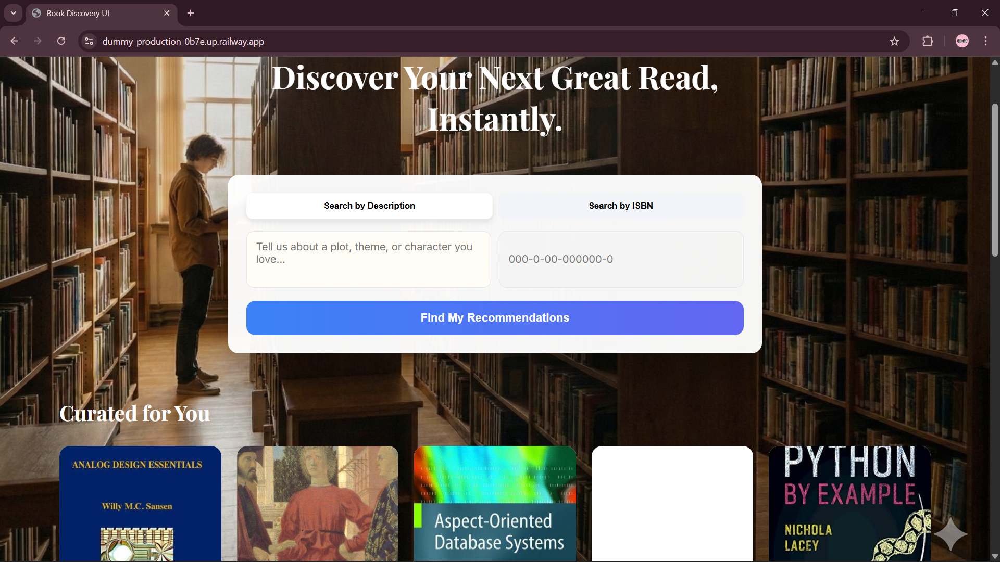
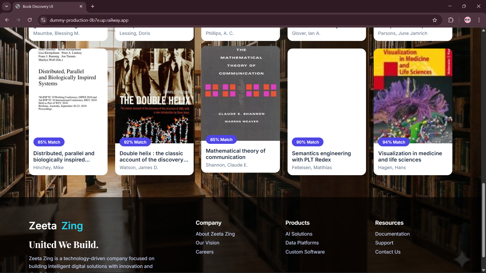

# 📚 AI Book Recommendation System

An end-to-end AI-powered book recommendation system built using **FastAPI**, **Sentence Transformers**, and **semantic search**.  
The system provides personalized book recommendations based on user queries and includes a lightweight frontend UI.

---

## 📌 Overview
- [🚀 Features](#-features)
- [📊 Dataset Statistics](#-dataset-statistics)
- [🗂️ Project Structure](#️-project-structure)
- [🛠️ Data Enrichment & Database Pipeline](#️-data-enrichment--database-pipeline)
- [🧠 System Architecture](#-system-architecture)
- [📦 Model & Assets Hosting](#-model--assets-hosting)
- [🔑 Hugging Face Token Setup (IMPORTANT)](#-hugging-face-token-setup-important)
- [🔧 Installation & Running (Local)](#-installation--running-local)
- [🧪 API Endpoints Documentation](#-api-endpoints-documentation)
- [⚙️ Technical Specifications](#️-technical-specifications)
- [🆘 Help & Troubleshooting Guide](#-help--troubleshooting-guide)
- [👤 Authors](#-authors)
- [🖼️ User Interface Preview](#️-user-interface-preview)


---

## 🚀 Public URL :
URL : https://web-production-7db7.up.railway.app/

---

## 🚀 Features

- 🔍 **Semantic book search** using Sentence Transformers (Context-aware search).
- 🧠 **Precomputed embeddings** for ultra-fast recommendation retrieval.
- ⚡ **REST API** built with FastAPI for high-performance asynchronous handling.
- 🎨 **Modern Frontend** (HTML, CSS, JavaScript) with a clean, responsive UI.
- 🐳 **Docker Ready** for consistent deployment across environments.
- ☁️ **Cloud Native Design**: Assets hosted on Hugging Face to bypass server memory/disk constraints.
- 🚆 **Production-ready** for platforms like Railway or Hugging Face Spaces.
- 🎲 **Discovery Mode**: Get random book suggestions to explore the library.

---

## 📊 Dataset Statistics

The dataset used in this project was collected, cleaned, and enriched to support semantic book recommendation using natural language descriptions.

### 📚 Dataset Overview
- **Total number of books:** ~**36,000**
- **Unique authors/editors:** ~**9,000+**
- **Publication year range:** **1950 – 2024**
- **Dataset size on disk:** ~**35 MB**

### 📝 Text Description Statistics
- **Average description length:** ~**120 words per book**
- **Missing descriptions before cleaning:** ~**18%**
- **Missing descriptions after cleaning:** **0%**

All missing or incomplete descriptions were either removed or enriched during preprocessing to ensure high-quality semantic embeddings.

### 🏷️ Subject / Genre Distribution (Top 5)
The dataset primarily covers academic and technical domains, including:
1. Computer Science
2. Artificial Intelligence
3. Mathematics
4. Engineering
5. Physics

This makes the dataset well-suited for a content-based recommendation system focused on educational and technical books.

### 🌍 Language Distribution
- **English:** ~**96%**
- **Other languages:** ~**4%**

Due to the dominance of English-language content, no language-specific filtering was required.

### ✅ Data Quality Notes
- Duplicate entries were removed
- Missing metadata fields were handled gracefully
- Text was normalized before embedding generation

Overall, the dataset is **clean, diverse, and semantically rich**, making it suitable for embedding-based similarity search and recommendation tasks.

---

## 🗂️ Project Structure

```text
BIG-DATA-ENGINEERING-/
├── api.py                      # Main FastAPI application & API routes
├── book_recommender.py         # Core recommendation logic & text parsing
├── requirements.txt            # Python library dependencies
├── Dockerfile                  # Containerization instructions
│
├── frontend/                   # Web interface source files
│   ├── index.html              # Main dashboard UI
│   ├── style.css               # Modern CSS styling (Glassmorphism inspired)
│   ├── script.js               # Frontend API interaction logic
│   └── library-bg.jpg          # UI background asset
│
├── images/                   
│   ├── ui_home.png             
│   └── ui_results.png          
│
├── data/                   
│   ├── raw_data              
│       └── dau_library_data.csv  #row data        
│   └── processed     
│       └── dau_with_description.csv #processed data
│
├── fetch_description/                    
│   ├── fetch_description.py    
│
├── logs/                    
│   ├── prompt.md 
│   
└── README.md                   
```

---

## 🔄 Data Enrichment & Database Pipeline

To ensure high-quality recommendations, the raw library data undergoes a multi-stage enrichment pipeline before being indexed.

### Pipeline Overview
`Raw CSV` ➔ `Enrichment Script` ➔ `Cleaning` ➔ `Vectorization` ➔ `Production Database`

### 1. Data Ingestion
- **Source**: Raw library catalog (`dau_library_data.csv`).
- **Fields**: ISBN, Title, Author, Year, Publisher.

### 2. Multi-Stage Enrichment (`fetch_description.py`)
The system employs a fallback strategy to fetch missing book descriptions and cover images:
1.  **OpenLibrary API**: Queries by ISBN to fetch descriptions and covers.
2.  **Google Books HTML**: Scrapes the Google Books public page if OpenLibrary fails.
3.  **Google Books API**: Uses `Title + Author` search as a final fallback for books with missing/invalid ISBNs.

### 3. Cleaning & Normalization
- **Deduplication**: Removes duplicate ISBNs.
- **Filtering**: Drops entries with missing descriptions or cover images.
- **Normalization**: Text is cleaned (lowercase, punctuation removal) for consistent processing.

### 4. Vectorization (Offline)
- **Model**: `all-MiniLM-L6-v2`
- **Process**: Each book description is converted into a **384-dimensional dense vector**.
- **Storage**: Vectors are saved as a NumPy array (`book_embeddings.npy`) for fast loading.

### 5. Database Construction (SQLite3)
- **Structure**: All enriched book metadata is stored in a **SQLite3** database (`books.db`).
- **Why SQLite?** It is serverless, file-based, and extremely lightweight. This makes it perfect for **FastAPI** deployments, allowing for high-speed metadata retrieval without the latency or complexity of connecting to an external database server like PostgreSQL or MySQL.

### 6. Asset Distribution
- **Hugging Face Hub**: The heavy files (Embeddings `book_embeddings.npy`, Database `books.db`, Model) are pushed to Hugging Face to decouple them from the application logic.
- **GitHub**: Only lightweight code is stored here.

---

---

## 🧠 System Architecture

The system follows a **Separation of Assets and Logic** pattern, common in modern ML Engineering.

1.  **Data Preprocessing (Offline)**:
    *   Raw data is cleaned using Python/Pandas.
    *   Missing metadata (descriptions/images) is fetched via external Book APIs.
2.  **Vectorization (Offline)**:
    *   Descriptions are passed through a `SentenceTransformer` model (`all-MiniLM-L6-v2`).
    *   A 384-dimensional vector is generated for every book and saved as a NumPy `.npy` file.
3.  **Asset Distribution**:
    *   The code is pushed to **GitHub**.
    *   The heavy files (Embeddings, Model, SQLite DB) are pushed to **Hugging Face Hub**.
4.  **Runtime Execution**:
    *   On startup, the app checks if `books.db` and `embeddings.npy` exist locally.
    *   If not, it fetches them using verified Hugging Face Hub download links.
    *   The model is loaded into memory for on-the-fly query encoding.
5.  **Semantic Search**:
    *   User query → Model → Vector.
    *   Vector → Cosine Similarity (against 31k vectors) → Top N Results.

---

## 📦 Model & Assets Hosting

This project uses model assets (embeddings, database, and weights) hosted on **Hugging Face Hub** to manage large file sizes and ensure efficient deployment. 

### 📂 Model Assets Repository
All core assets including `.pkl`, `.pt`, `.db`, `.npy`, and `.model` files are hosted at:
👉 **[huggingface.co/dummy9016/book-recommender-assets](https://huggingface.co/dummy9016/book-recommender-assets/tree/main)**

These embeddings enable semantic similarity search for content-based book recommendation.

### 📌 Model Used
- **Model name:** `sentence-transformers/all-MiniLM-L6-v2`
- **Architecture:** Transformer-based sentence embedding model
- **Embedding dimension:** 384
- **Use case:** Semantic text similarity and information retrieval

This model was selected due to its strong balance between performance, speed, and memory efficiency, making it suitable for both local development and cloud deployment.

### 🚀 Why Hugging Face?
Hugging Face Hub is used to host and access models because:
- It avoids committing large model files to GitHub
- It enables lightweight cloud deployments (Railway, Docker, etc.)
- Models are automatically cached after first download
- Secure access is supported via access tokens

This approach keeps the repository clean and prevents memory-related build failures.

### 🔐 Authentication & Access
Access to Hugging Face models is handled securely using a **read-only access token**.

#### Creating a Token
1. Create an account at https://huggingface.co
2. Go to **Settings → Access Tokens**
3. Generate a token with **Read** permission

#### Storing the Token
Set the token as an environment variable:

```bash
export HF_TOKEN=your_token_here   # Linux / macOS
setx HF_TOKEN "your_token_here"   # Windows
```

### ⚙️ Model Loading Behavior

At runtime:

- The model is downloaded from Hugging Face Hub
- Cached locally inside the environment
- Reused across subsequent runs

This ensures fast startup after the initial download and efficient memory usage.

### ☁️ Cloud Deployment Considerations

For cloud platforms (e.g., Railway, Docker-based services):

- Model files are not included in the repository
- The Hugging Face token is provided via environment variables
- Model download occurs during application startup

This design avoids large build artifacts and reduces deployment failures caused by memory limits.

### ❓ Why Hugging Face?
*   **Railway Limits**: Free/Trial tiers often have < 4GB disk space and limited RAM. Storing 500MB+ of model data in the Docker image causes slow boots and potential "Out of Disk" errors.
*   **GitHub Limits**: GitHub LFS is limited/paid for large files. Standard git repos should be kept under 100MB for optimal performance.
*   **Accessibility**: Hugging Face acts as a "Model CDN", serving assets with high availability.

### 📁 Asset Breakdown

| Asset | Type | Location | Purpose |
| :--- | :--- | :--- | :--- |
| **Code** | Python/JS | [GitHub](https://github.com/sahilvasani39-art/dummy) | Application logic and UI |
| **Embeddings** | `.npy` | [Hugging Face](https://huggingface.co/dummy9016/book-recommender-assets/tree/main) | Pre-calculated semantic vectors |
| **Metadata** | `.pkl`, `.db` | [Hugging Face](https://huggingface.co/dummy9016/book-recommender-assets/tree/main) | Book metadata & search database |
| **Model Weights**| `.pt`, `.model`| [Hugging Face](https://huggingface.co/dummy9016/book-recommender-assets/tree/main) | Query encoding models |

---

## 🔑 Hugging Face Token Setup (IMPORTANT)

This project **downloads datasets and models from Hugging Face at runtime**. For seamless access:

### Step 1: Create Account
Join the community: [huggingface.co/join](https://huggingface.co/join)

### Step 2: Generate Access Token
1.  Navigate to: [huggingface.co/settings/tokens](https://huggingface.co/settings/tokens)
2.  Click **New token**.
3.  Configuration:
    *   **Name:** `railway-deploy`
    *   **Role:** `Read` (Write is not needed for production).
4.  **Copy the token immediately.** It starts with `hf_`.

---

## 🔧 Installation & Running (Local)

### 1️⃣ Setup Environment
```bash
git clone https://github.com/your-username/book-recommendation-system.git
cd book-recommendation-system

# Create virtual environment
python -m venv venv

# Activate (Windows)
venv\Scripts\activate

# Activate (Linux/Mac)
source venv/bin/activate
```

### 2️⃣ Install Dependencies
```bash
pip install -r requirements.txt
```

### 3️⃣ Authentication
Create a `.env` file or export the variable:
```bash
export HF_TOKEN=hf_your_token_string_here
```

### 4️⃣ Execution
```bash
uvicorn api:app --reload
```
The console will show `🚀 Loading assets from Hugging Face...`. Once successful, you can visit `localhost:8000`.

---

## 🐳 Run with Docker

Perfect for local testing in a production-like environment.

**Build:**
```bash
docker build -t book-recommender .
```

**Run:**
```bash
docker run -p 8000:8000 -e HF_TOKEN=your_token book-recommender
```

---

## 🚀 Deploy on Railway

### 1️⃣ Push to GitHub
```bash
git add .
git commit -m "Production ready documentation"
git push origin main
```

### 2️⃣ Railway Configuration
1.  Create **New Project** → **Deploy from GitHub Repo**.
2.  Go to **Variables** tab and add:
    *   `HF_TOKEN`: `hf_xxxxxxxxxxxxxxxxx`
    *   `HF_HOME`: `/app/.cache/huggingface` (Prevents frequent re-downloads)
3.  Go to **Settings** → **Deploy** → **Start Command**:
    ```bash
    uvicorn api:app --host 0.0.0.0 --port ${PORT:-8080}
    ```

---

## 🧪 API Endpoints Documentation

| Method | Route | Description |
| :--- | :--- | :--- |
| `GET` | `/` | Root endpoint serving the HTML Frontend. |
| `POST` | `/recommend` | Accepts JSON `{"description": "..."}` and returns top 15 books. |
| `GET` | `/random` | Returns a randomized selection of books for exploration. |
| `GET` | `/book/isbn/{isbn}` | Retrieves full metadata for a specific ISBN. |
| `GET` | `/docs` | Interactive Swagger UI for testing endpoints. |

---

## ⚙️ Technical Specifications
*   **Embedding Model**: `all-MiniLM-L6-v2` (Sentence-Transformers)
*   **Vector Metric**: Cosine Similarity
*   **Backend Framework**: FastAPI (Asynchronous)
*   **Database**: SQLite3 (Filesystem-based)
*   **Frontend**: Vanilla JS (ES6) + CSS Grid/Flexbox

---


# 🆘 Help & Troubleshooting Guide

This section provides solutions to common issues encountered during setup, deployment, and runtime.

---

## 🔑 Authentication Issues

### ❌ Error: 401 Unauthorized or model download fails
**Cause:** Missing or invalid Hugging Face access token.

**Solution:**

Verify token exists:

```bash
echo $HF_TOKEN
```

If empty, set the token:

**Linux/macOS**

```bash
export HF_TOKEN=hf_your_token_here
```

**Windows**

```bash
setx HF_TOKEN "hf_your_token_here"
```

Restart the application.

### ❌ Error: Repository Not Found or Access Denied
**Cause:** Private repository without proper permissions.

**Solution:**
- Ensure token has Read access
- Verify repository exists:  
  https://huggingface.co/dummy9016/book-recommender-assets

---

## 🚀 Application Startup Issues

### ❌ Error: ModuleNotFoundError
**Cause:** Missing dependencies.

**Solution:**
```bash
pip install -r requirements.txt
```

### ❌ Error: Port already in use
**Cause:** Port 8000 already occupied.

**Solution:**
```bash
uvicorn api:app --reload --port 8001
```

### ❌ Error: Uvicorn not recognized
**Cause:** Virtual environment not activated.

**Solution:**

**Windows**
```bash
venv\Scripts\activate
```

**Linux/macOS**
```bash
source venv/bin/activate
```

---

## 🤖 Model & Embedding Issues

### ❌ Slow startup on first run
**Cause:** Model and embeddings downloading from Hugging Face.

**Expected behavior:** First run may take 1–3 minutes.

**Solution:** No action needed. Files will be cached automatically.

### ❌ Error: embeddings.npy not found
**Cause:** Download failed or incomplete.

**Solution:**
```bash
rm -rf .cache/huggingface
```

Restart app:
```bash
uvicorn api:app --reload
```

---

## 🌐 API Issues

### ❌ Error: 405 Method Not Allowed
**Cause:** Using wrong HTTP method.

**Correct usage:**
```
POST /recommend
```

**Example request:**
```json
{
  "description": "machine learning neural networks"
}
```

### ❌ Error: CORS blocked request
**Cause:** Frontend and backend running on different domains.

**Solution:** Enable CORS in FastAPI:

```python
from fastapi.middleware.cors import CORSMiddleware

app.add_middleware(
    CORSMiddleware,
    allow_origins=["*"],
    allow_credentials=True,
    allow_methods=["*"],
    allow_headers=["*"],
)
```

---

## 🐳 Docker Issues

### ❌ Container exits immediately
**Cause:** Missing environment variables.

**Solution:**
```bash
docker run -p 8000:8000 -e HF_TOKEN=your_token book-recommender
```

### ❌ Error: Out of disk space
**Cause:** Model files require storage.

**Solution:**
- Free disk space
- Use Hugging Face asset hosting (recommended)

---

## ☁️ Railway Deployment Issues

### ❌ App crashes after deploy
Check Railway → Project → Variables

Ensure:
```
HF_TOKEN=hf_xxxxx
HF_HOME=/app/.cache/huggingface
```

### ❌ App stuck on deploying
Set correct start command:
```bash
uvicorn api:app --host 0.0.0.0 --port ${PORT:-8080}
```

---

## 🖥️ Frontend Issues

### ❌ Books not loading
**Cause:** Backend not running or wrong API URL.

**Solution:**
- Check backend: http://localhost:8000/docs  
- Update frontend API URL if needed:

```js
const API_URL = "http://localhost:8000";
```

### ❌ Images not displaying
**Cause:** Invalid image URL or network issue.

**Solution:**
- Verify image links in dataset
- Check browser console for errors

---

## ⚡ Performance Optimization Tips

Use Hugging Face cache:

```bash
export HF_HOME=.cache/huggingface
```

Run production server:

```bash
uvicorn api:app --host 0.0.0.0 --port 8000 --workers 4
```

---

## 👤 Authors

**Sahil**  
*Master’s Student – Data Science*  
Passionate about Machine Learning, Deep Learning, and end-to-end implementation of AI products.

**Raj**  
*Master’s Student – Data Science*  
Specialist in Data Engineering, Vector Databases, and Cloud AI deployment strategies.

---

## 🎯 Future Roadmap

*   [ ] Integration with **FAISS** index for millisecond search over 1M+ records.
*   [ ] **User Personalization**: Allow users to 'save' books to build a preference profile.
*   [ ] **Image Recognition**: Take a photo of a book cover to get similar recommendations.
*   [ ] **Multi-language Search**: Support queries in Hindi, Spanish, French, etc.


---

## 🖼️ User Interface Preview

### 🔍 Home Page


### 📖 Recommendation Results



---